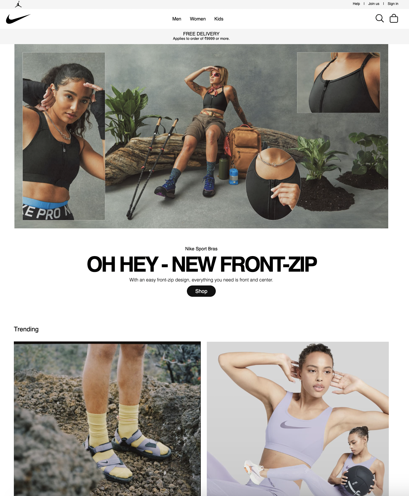
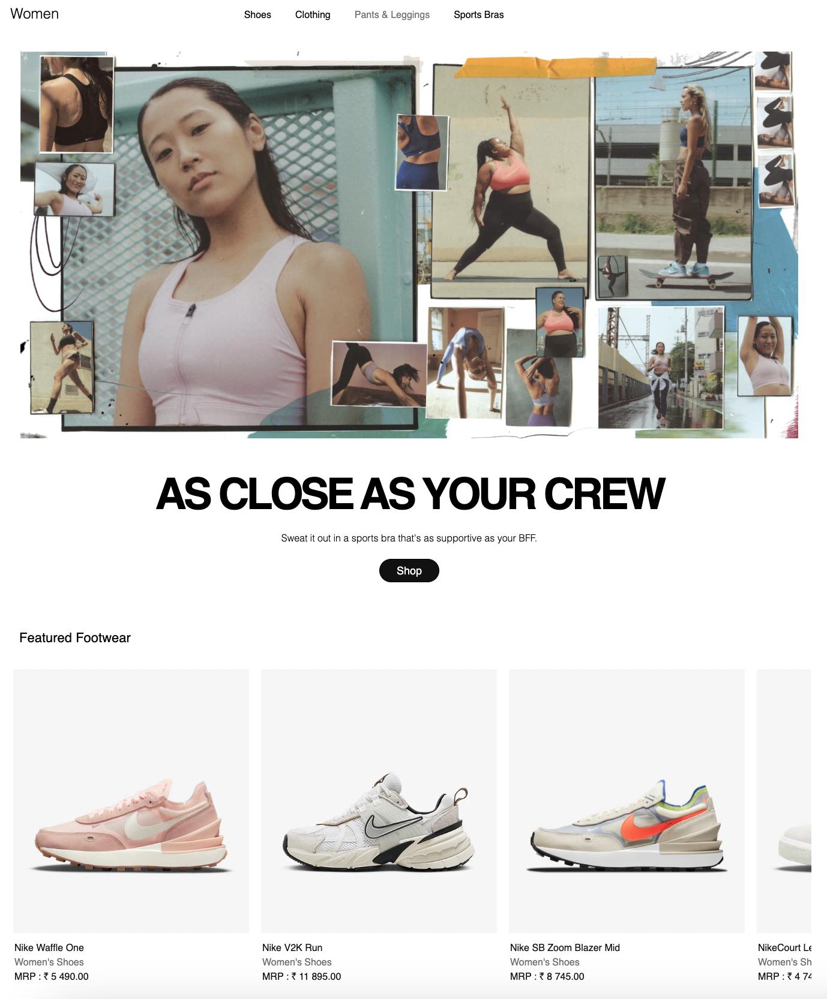
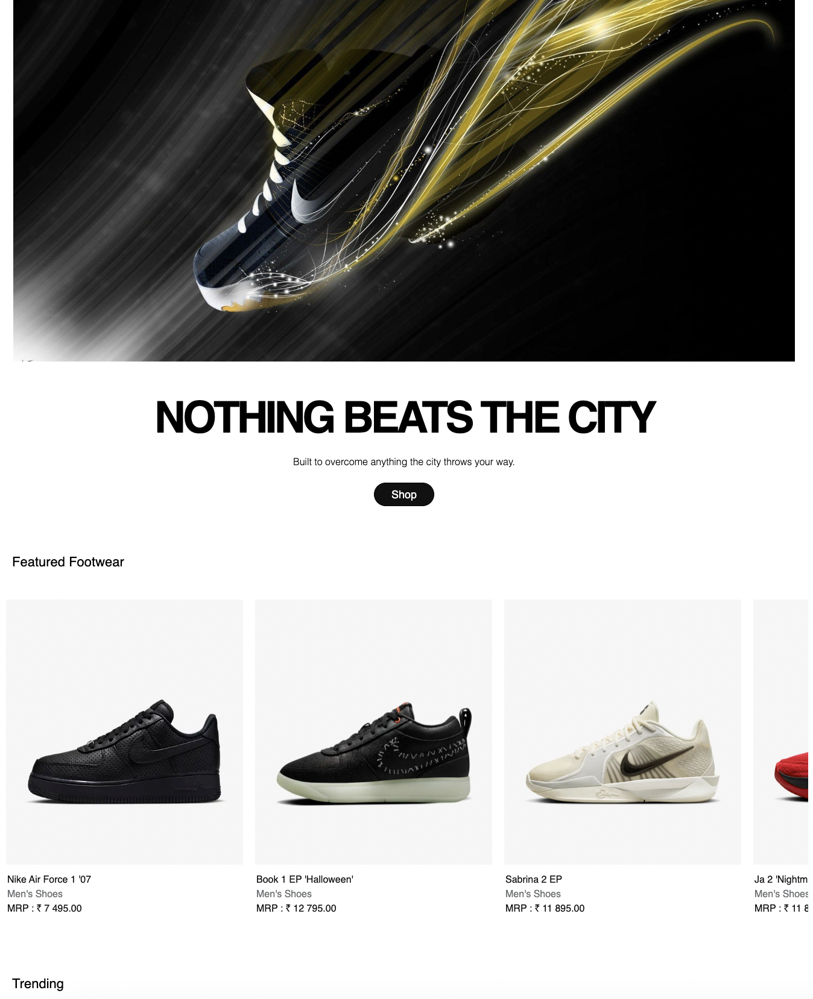

# Flexi Credit Project
# 🏀 Nike Website Clone

Welcome to the **Nike Website Clone** project! This is a front-end web development project built to replicate the design and functionality of a modern Nike e-commerce website. The project aims to give a realistic shopping experience and includes several interactive features.

---

## 🚀 Project Overview

The **Nike Website Clone** is a responsive, fully-functional website designed using **HTML** and **CSS**. It showcases various Nike products, complete with categories, filtering options, and product detail pages to replicate a professional e-commerce environment.

**Demo Screenshot**  


---

## 💻 Technologies Used

- **HTML** - For structuring the content and layout of the pages.
- **CSS** - For styling, layout design, and animations to match the look and feel of the official Nike site.

---

## 🌟 Features

### Home Page
- **Hero Banner**: A large, visually appealing banner with call-to-action buttons.
- **Trending Products**: A showcase of popular products with animations and hover effects.

### Product Pages
- **Categories and Filters**: Users can browse through various categories, such as footwear, apparel, and accessories.
- **Product Detail View**: Each product has its own page with images, descriptions, and price details.

### Cart and Checkout (Frontend)
- **Add to Cart**: Users can select items to add to their cart.
- **Checkout Page**: A summary page of items in the cart with mock payment options.

### Responsive Design
- **Mobile-Friendly**: The website is optimized for mobile devices, ensuring that the user experience is seamless across different screen sizes.

---


---

## 📸 Screenshots

| Homepage                                | Product Page                           | Homepage                                |
|-----------------------------------------|----------------------------------------|-----------------------------------------|
|  |  |  |


---

## 🤔 Challenges and Learning

This project was a fantastic learning experience for improving HTML and CSS skills, particularly in creating complex layouts and responsive design. Key challenges included:
- Designing a responsive grid layout.
- Implementing hover effects and animations.
- Mimicking the high-quality UI/UX of a professional brand site.

---

## 📈 Future Improvements

- **JavaScript Interactivity**: Adding interactive functionality for cart management, filtering, and product searching.
- **Backend Integration**: Connecting the front-end with a database to manage real product data.
- **User Authentication**: Implementing sign-in and sign-up features.

---

## 🤝 Contributions
 - Feel free to fork this project, submit issues, or make pull requests. Contributions are always welcome!


## 🛠 Setup & Installation

1. **Clone the Repository**
   ```bash
   git clone git@github.com:sukaransingh123/flexi_credit-.git


